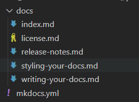
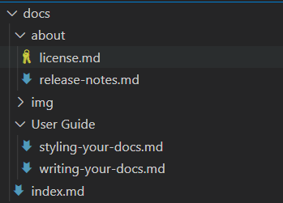

# MkDocs 撰写文档

> [撰写文档 - MkDocs 中文文档](https://markdown-docs-zh.readthedocs.io/zh_CN/latest/user-guide/writing-your-docs/)

> [Writing Your Docs - MkDocs](https://www.mkdocs.org/user-guide/writing-your-docs/)

如何撰写 markdown 源码并安排目录结构.


## 目录结构

文档是普通的 Markdown 文件, 放到项目目录里. 通常目录以 `docs` 命名, 和 `mkdocs.yml` 配置文件一起放置于项目的顶级目录中.

最简单的项目目录结构可能是这样的:

```CSS
mkdocs.yml
docs/
    index.md
```

默认项目主页是 `index`. Markdown 源码文件的后缀可以是以下任意一种: `markdown`, `mdown`, `mkdn`, `mkd`, `md`.

你可以创建多个 markdown 文件以创建多页文档:

```CSS
mkdocs.yml
docs/
    index.md
    about.md
    license.md
```

文档目录结构决定着生成的文档的 URLs . 如果采用如上目录结构, 生成的 URLs 将会如下所示:

```JavaScript
/
/about/
/license/
```

你也可以根据需要将 Markdown 文件放到多级目录.

```CSS
docs/
    index.md
    user-guide/getting-started.md
    user-guide/configuration-options.md
    license.md
```

多级目录将生成多级 URLs, 如下所示:

```JavaScript
/
/user-guide/getting-started/
/user-guide/configuration-options/
/license/
```


## 索引页面

当请求一个目录时，默认情况下，大多数web服务器将返回该目录中包含的索引文件（通常称为`index.html`）（如果存在）。因此，上面所有示例中的主页都被命名为`index.md`，其中MkDocs将呈现给索引。在构建网站时使用html。

许多存储库托管站点通过在浏览目录内容时显示自述文件的内容来对自述文件进行特殊处理。因此，MkDocs将允许您将索引页面命名为`README.md`而不是索引。


## 配置页面和导航

mkdocs中的导航配置在`mkdocs.yml`文件定义全局站点导航菜单中包含的页面以及该菜单的结构。如果未提供，将通过查找文档目录中的所有标记文件自动创建导航。自动创建的导航配置将始终按文件名按字母数字排序（除非索引文件始终在子节中首先列出）。如果希望导航菜单以不同方式排序，则需要手动定义导航配置。

简单例子如下：

```YAML
nav:
    - 'index.md'
    - 'about.md'
```

上面的示例将导致在顶层创建两个导航项，并根据标记文件的内容推断其标题，或者，如果文件中未定义标题，则根据文件名推断其标题。要覆盖导航设置中的标题，请在文件名前添加标题。

```Groovy
nav:
    - Home: 'index.md'
    - About: 'about.md'
```

请注意，如果在导航中为页面定义了标题，则该标题将在该页面的整个站点中使用，并将覆盖页面本身中定义的任何标题。

导航子部分可以通过在部分标题下列出相关页面来创建。例如：

```Groovy
nav:
    - Home: 'index.md'
    - 'User Guide':
        - 'Writing your docs': 'writing-your-docs.md'
        - 'Styling your docs': 'styling-your-docs.md'
    - About:
        - 'License': 'license.md'
        - 'Release Notes': 'release-notes.md'
```

通过上述配置，我们拥有三个顶级项目：“主页”、“用户指南”和“关于”。“主页”是指向站点主页的链接。在“用户指南”部分下列出了两页：“编写文档”和“设计文档样式”。在“关于”部分下还列出了两个页面：“许可”和“发行说明”。则目前我们的项目文件结果为：



此外，我们可以建立`docs`目录下子文件夹进行规范md文件



yml文件的格式相应改为相对路径：

```Groovy
nav:
  - 主页: 'index.md'
  - User Guide:
    - Writing your docs: User Guide/writing-your-docs.md
    - Styling your docs: User Guide/styling-your-docs.md
  - About:
    - License: 'about/license.md'
    - Release Notes: 'about/release-notes.md'
```


## 链接

MkDocs 可以使用 Markdown 超链接语法来创建链接.

创建内部超链接只需使用 Markdown 超链接语法, 包含目标 Markdown 文档的相对路径即可.

```CSS
Please see the [project license](license.md) for further details.
```

当运行 MkDocs 构建工具时, 超链接将指向相应的 HTML 页面.

你可以通过点击链接以在新编辑器窗口中打开目标 Markdown 文档.

如果目标文档在另一个目录中, 确保超链接中正确包含了相对路径.

```CSS
Please see the [project license](../about/license.md) for further details.
```

你可用通过锚链接以定位到目标文档的特定部分. 生成的 HTML 将正确转换路径部分, 而不会去改变锚链接部分.

```CSS
Please see the [project license](about.md#license) for further details.
```


## 图片和多媒体

除了 Markdown 文件, 你可以在文档中包含其他文件, 这些文件将在你构建文档时被复制到指定位置. 可以包含图片和其他多媒体.

例如, 如果你的文档需要包含一个 [GitHub pages CNAME file](https://help.github.com/articles/setting-up-a-custom-domain-with-pages#setting-the-domain-in-your-repo) 和 一张 PNG 图片, 你可以安排目录结构如下:

```CSS
mkdocs.yml
docs/
    CNAME
    index.md
    about.md
    license.md
    img/
        screenshot.png
```

要包含图片到你的源码文档, 只需使用 Markdown 语法:

```bash

```

图片链接将在构建时被嵌入, 如果使用了 Markdown 编辑器, 你还可以实时预览.


## Markdown 扩展

MkDocs 支持以下 Markdown 扩展.

#### 表格

以下是一个简单的表格:

```Gherkin
First Header | Second Header | Third Header
------------ | ------------- | ------------
Content Cell | Content Cell  | Content Cell
Content Cell | Content Cell  | Content Cell
```

可以在起始和结束位置添加管道到表格:

```Gherkin
| First Header | Second Header | Third Header |
| ------------ | ------------- | ------------ |
| Content Cell | Content Cell  | Content Cell |
| Content Cell | Content Cell  | Content Cell |
```

可以在分隔符行添加冒号已指定每一列的对其方式:

```Ruby
First Header | Second Header | Third Header
:----------- | :-----------: | -----------:
Left         | Center        | Right
Left         | Center        | Right
```

#### 代码块

以三个以上 ` （反引号）开始一行, 并在结束位置以相同数目的反引号 ` （反引号）开始一行即可包含一个代码块:

~~~Assembly%20language
```
Fenced code blocks are like Stardard
Markdown regular code blocks, except that
theye not indented and instead rely on a
start and end fence lines to delimit the code
block.
```
~~~


## 原始HTML链接

当Markdown语法不符合作者的需要时，Markdown允许文档作者回退到原始HTML。MkDocs在这方面并不限制Markdown。 但是，由于Markdown解析器忽略了所有原始HTML，因此MkDocs无法验证或转换原始HTML中包含的链接。在原始HTML中包含内部链接时，您需要为呈现的文档手动格式化链接。


## Meta-Data 元数据

MkDocs包括支持YAML和MultiMarkdown两种样式的元数据（通常称为前端内容）。元数据由Markdown文档开头定义的一系列关键字和值组成，这些关键字和值在Python-Markdown处理之前从文档中删除。键/值对由MkDocs传递给页面模板。 因此，如果主题支持，则任何键的值都可以显示在页面上或用于控制页面呈现。有关可能支持哪些关键字的详细信息，请参阅相应的主题支持文档（如果有）。

除了在模板中显示信息之外，MkDocs还支持一些预定义的元数据键，这些键可以改变该特定页面的MkDoc的行为。支持以下键：

`template`:

The template to use with the current page.

用于当前页面的模板。

默认情况下，MkDocs使用主题的`main.html`模板来呈现Markdown页面。您可以使用`template`元数据键为该特定页面定义不同的模板文件。模板文件必须在主题环境中定义的路径上可用。

`title`:

用于文档的“标题”。

MkDocs将尝试按以下方式确定文档的标题：

1.在文档的[nav](https://mkdocs.zimoapps.com/user-guide/configuration/#nav)配置设置中定义的标题。

2.在文档的“title”元数据键中定义的标题。

3.文档正文第一行上的1级Markdown标题。

4.文档的文件名。

在找到页面的标题后，MkDoc不会继续检查上面列表中的任何其他来源。

#### YAML样式元数据

YAML样式元数据由YAML样式分隔符中包含的[YAML](http://yaml.org/)键/值对组成，以标记元数据的开始和/或结束。 文档的第一行必须是`---`。 元数据在结束的那一行，需包含一个结束分隔符（`---`或`...`）。 分隔符之间的内容被解析为[YAML](http://yaml.org/)。

```YAML
---
title: My Document
summary: A brief description of my document.
authors:
    - Waylan Limberg
    - Tom Christie
date: 2018-07-10
some_url: https://example.com
---
This is the first paragraph of the document.
```

YAML能够检测数据类型。因此，在上面的例子中，`title`，`summary`和`some_url`的值是字符串，`authors`的值是字符串列表，`date`的值是`datetime.date`对象。请注意，YAML键区分大小写，MkDocs期望键全部为小写。YAML的顶级必须是键/值对的集合，这导致返回Python`dict`。如果返回任何其他类型或YAML解析器遇到错误，则MkDocs不会将该部分识别为元数据，页面的`meta`属性将为空，并且该部分不会从文档中删除。

#### MultiMarkdown样式元数据

MultiMarkdown样式元数据使用[MultiMarkdown](http://fletcherpenney.net/MultiMarkdown_Syntax_Guide#metadata)项目首先引入的格式。该数据由Markdown文档开头定义的一系列关键字和值组成，如下所示：

```YAML
Title:   My Document
Summary: A brief description of my document.
Authors: Waylan Limberg
         Tom Christie
Date:    January 23, 2018
blank-value:
some_url: https://example.com

This is the first paragraph of the document.
```

关键字不区分大小写，可以包含字母，数字，下划线和短划线，并且必须以冒号结尾。值由冒号后面的任何内容组成，甚至可以为空。

如果一行由4个或更多空格缩进，则该行被假定为前一个关键字的值的附加行。关键字可以包含所需的行数。所有行都连接成一个字符串。

第一个空白行结束文档的所有元数据。 因此，文档的第一行不能为空。